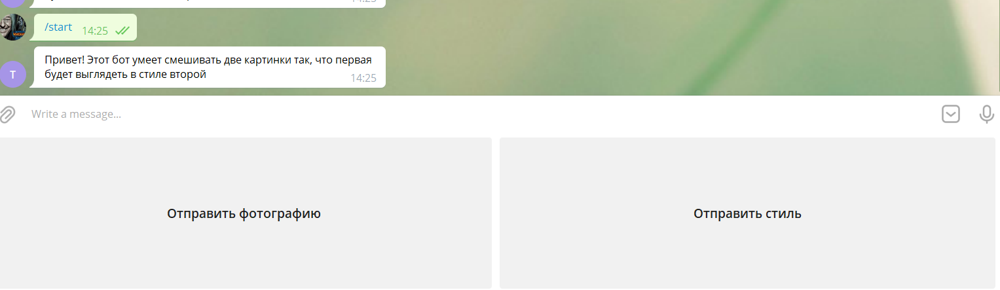
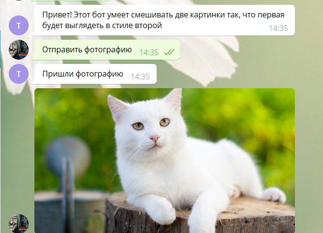
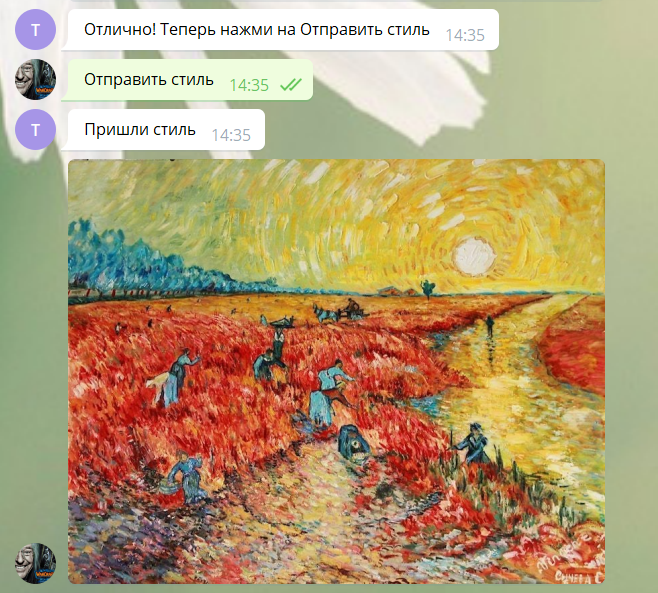
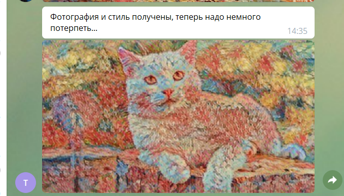

# TensorFlowBot
## Описание
Бот, написанный на Python и использующий библиотеку TensorFlow. На вход принимает два изображения:
 * Изображение для обработки
 * Сам стиль  
В итоге получается исходное изображение в стиле второго.  
## Скриншоты работы бота

  
  
    
  
  

